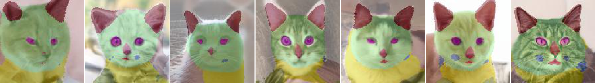

## An alignment for Animal Faces-HQ dataset (AFHQ)
<p align="left"></p>
[AFHQ](https://github.com/clovaai/stargan-v2/) is a high-quality (512x512) image dataset of animal faces, totally consisting 15,000 images of cats, dog and wildlife. A description of the alignment method for AFHQ is quoted from Paperswithcode website.

> All images are vertically and horizontally aligned to have the eyes at the center.
> https://paperswithcode.com/dataset/afhq

In this repository, our alignment is based on [Flickr-Faces-HQ Dataset (FFHQ) Alignment](https://github.com/NVlabs/ffhq-dataset/blob/master/download_ffhq.py#L259-L380). We modify the function into the alignment without a measure between eyes and mouth. The results show as following,
<p align="left"></p>

### Package requirements
```
numpy
scipy
Pillow (Image)
```

### Usage
```
from afhq_alignment import recreate_aligned_images
recreate_aligned_images(<IMAGE>, (<LEFT_EYE>, <RIGHT_EYE>), 
                        <OUTPUT_SIZE>, <TRANSFORM_SIZE>,
                        <ENABLE_PADDING>, <IMAGE_TYPE>)

arguments:
  <IMAGE>: a type of Pillow Image
  (<LEFT_EYE>, <RIGHT_EYE>): (Integer, Integer) or numpy array, A (x,y) coordinate of left and right eyes.
  <OUTPUT_SIZE>: Integer, Image size
  <TRANSFORM_SIZE>: Integer, Image size while affine processing
  <ENABLE_PADDING>: Bool
  <IMAGE_TYPE>: String, "raw" or "segmentation"
```
* The (x,y) coordinate is based on opencv axis rules.
* To solve our labeling situation, we add a switch of raw image or segmentation image
* This function is one image process. You need to modify into batch or additional features by yourself.